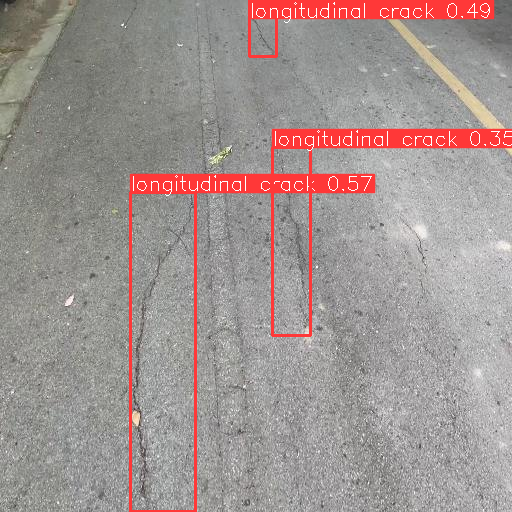
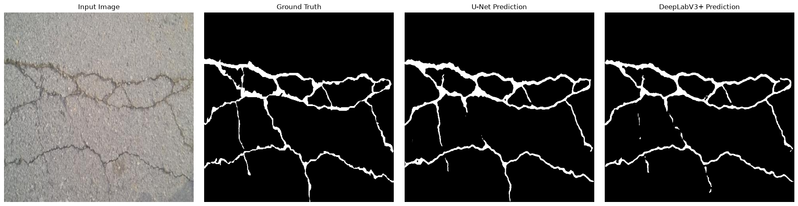

# Road Damage Detection and Crack Segmentation Using YOLOv8, YOLO11, Faster R-CNN, SAHI, U-Net, and DeepLabV3+

This repository contains the experiments, trained models, and results for a Bachelor's thesis on automated road damage detection and crack segmentation using deep learning. The work spans approximately two months of systematic experimentation across seven object detection architectures, two semantic segmentation models, and slicing-aided inference (SAHI) evaluation on public benchmark datasets.

---

## Project Overview

Road surface deterioration poses risks to vehicle safety and increases maintenance costs. Manual inspection is slow and inconsistent. This project investigates deep learning approaches for two complementary tasks:

1. **Object Detection** -- localizing and classifying road damage types (longitudinal cracks, transverse cracks, alligator cracks, potholes, and other surface corruption) using bounding box predictions on the RDD2022 dataset.
2. **Semantic Segmentation** -- producing pixel-level crack masks on the Crack500 dataset to enable fine-grained damage assessment.

Additionally, SAHI (Slicing Aided Hyper Inference) was evaluated across all detection models to assess its effectiveness on small and distant road defects. An ablation study on SAHI hyperparameters and an exploratory two-stage detector experiment round out the investigation.

<p align="center">
  
</p>

<p align="center">
  <em>Figure 1. Road damage detections produced by YOLO11n on the RDD2022 dataset.</em>
</p>

---

## Project Highlights

- Seven detection models compared under identical training conditions on the full RDD2022 dataset
- SAHI evaluation on every YOLO variant with quantitative detection count analysis
- YOLO11m SAHI ablation study covering confidence threshold and slice size
- Exploratory Faster R-CNN + SAHI experiment with discussion of failure modes
- U-Net and DeepLabV3+ segmentation on Crack500 with qualitative comparison
- Literature comparison against recent RDD2022 and Crack500 methods (2020--2025)
- Full experimental artifacts: training curves, confusion matrices, PR/F1 curves, and thesis-ready figures

---

## Repository Structure

```text
Thesis/
├── datasets/
│   └── RDD_SPLIT/              # RDD2022 train/val/test splits (YOLO format)
├── detection/
│   └── checkpoints/            # Trained model weights (.pt, .pth)
├── notebooks/                  # 19 Jupyter notebooks (training, evaluation, SAHI, segmentation)
├── reports/
│   ├── literature_review/      # Reference papers and summary findings
│   ├── results/
│   │   ├── detection/          # Per-model metrics, curves, and examples
│   │   ├── segmentation/       # U-Net and DeepLabV3+ results
│   │   ├── eda/                # Dataset exploration figures
│   │   └── final_figures/      # Thesis-ready visualizations
│   ├── final_report/
│   └── methodology/
├── presentations/
├── requirements.txt
└── README.md
```

---

## Datasets

### RDD2022 (Detection)

The Road Damage Detection 2022 dataset contains road-view images from India, Japan, Norway, the United States, and the Czech Republic. Images are annotated with bounding boxes across five damage classes:

| Class ID | Label |
|----------|-------|
| 0 | Longitudinal Crack |
| 1 | Transverse Crack |
| 2 | Alligator Crack |
| 3 | Other Corruption |
| 4 | Pothole |

The dataset was split into train (26,870 images), validation (5,759 images), and test (5,759 images) sets in YOLO format.

### Crack500 (Segmentation)

Crack500 is a binary segmentation dataset for pixel-level road crack extraction. Both segmentation models were trained for 30 epochs with a batch size of 8 using a ResNet34 encoder.

---

## Detection Experiments

Seven models were trained and evaluated on the RDD2022 dataset: YOLOv8 (n, s, m), YOLO11 (n, s, m), and Faster R-CNN (ResNet50-FPN).

### Baseline Comparison

| Model | Precision | Recall | mAP@50 | mAP@50-95 |
|-------|-----------|--------|--------|-----------|
| YOLOv8n | 0.579 | 0.516 | 0.539 | 0.285 |
| YOLOv8s | 0.626 | 0.553 | 0.592 | 0.317 |
| **YOLOv8m** | **0.677** | **0.590** | **0.633** | **0.344** |
| YOLO11n | 0.593 | 0.514 | 0.544 | 0.287 |
| YOLO11s | 0.613 | 0.540 | 0.575 | 0.309 |
| YOLO11m | 0.631 | 0.546 | 0.587 | 0.314 |
| Faster R-CNN | N/A | 0.427 | 0.536 | 0.253 |

### Observations

- **YOLOv8m** achieved the highest scores across all four metrics and was selected as the final detection model.
- Within both the YOLOv8 and YOLO11 families, larger variants consistently outperformed smaller ones.
- YOLO11 models produced competitive results close to their YOLOv8 counterparts. During qualitative inspection, YOLO11 variants appeared to generate fewer false positives on challenging images (snow, vegetation, varied road textures), though this advantage was less clear in the SAHI evaluation metrics.
- Faster R-CNN served as a reasonable two-stage baseline but underperformed the larger YOLO variants.

---

## SAHI Evaluation

SAHI divides input images into smaller overlapping slices, runs detection on each slice independently, and merges the predictions. This improves sensitivity to small and distant road defects that are often missed during standard full-image inference.

### Detection Count Improvement

| Model | Baseline Detections | SAHI Detections | Improvement |
|-------|--------------------:|----------------:|------------:|
| YOLOv8n | 3,773 | 4,564 | +20.96% |
| **YOLOv8s** | **4,237** | **5,475** | **+29.22%** |
| YOLOv8m | 4,551 | 5,321 | +16.92% |
| YOLO11n | 3,612 | 4,496 | +24.47% |
| YOLO11s | 4,016 | 4,826 | +20.17% |
| YOLO11m | 3,986 | 4,722 | +18.46% |

### SAHI COCO Evaluation

| Model | Precision | Recall | mAP@50 | mAP@50-95 |
|-------|-----------|--------|--------|-----------|
| YOLOv8n | 0.380 | 0.285 | 0.380 | 0.186 |
| YOLOv8s | 0.441 | 0.311 | 0.441 | 0.218 |
| **YOLOv8m** | **0.484** | **0.347** | **0.484** | **0.247** |
| YOLO11n | 0.380 | 0.277 | 0.380 | 0.184 |
| YOLO11s | 0.421 | 0.301 | 0.421 | 0.207 |
| YOLO11m | 0.412 | 0.301 | 0.412 | 0.203 |

### Observations

- SAHI increased detection counts across all six YOLO models. Most additional detections were small road damages missed during standard inference.
- YOLOv8s achieved the largest relative improvement (+29.22%), while YOLO11n led among YOLO11 variants (+24.47%).
- The COCO evaluation shows a trade-off: SAHI improves recall of small objects but introduces additional false positives, reducing precision and mAP relative to baselines.
- YOLOv8m remained the strongest model under SAHI as well.

<p align="center">
  
</p>

<p align="center">
  <em>Figure 2. Standard YOLOv8m inference (left) vs. SAHI-enhanced inference (right). Sliced inference recovers small and distant defects missed by full-image detection.</em>
</p>

---

## YOLO11m SAHI Ablation Study

An ablation study was conducted using YOLO11m to evaluate the effect of two SAHI hyperparameters: confidence threshold and slice size.

| Slice Size | Confidence | Precision | Recall | mAP@50 | mAP@50-95 |
|------------|------------|-----------|--------|--------|-----------|
| 512 x 512 | 0.25 | 0.412 | 0.301 | 0.412 | 0.203 |
| 512 x 512 | 0.50 | 0.307 | 0.218 | 0.307 | 0.171 |
| 640 x 640 | 0.25 | 0.402 | 0.299 | 0.402 | 0.208 |

- **Confidence threshold**: Raising the threshold from 0.25 to 0.50 suppressed false positives but also discarded many correct detections, significantly reducing recall and mAP.
- **Slice size**: Increasing slice dimensions from 512 to 640 did not improve performance.
- The default configuration (512 x 512, confidence 0.25) provided the best balance between detection sensitivity and false positive rate and was used for all remaining SAHI evaluations.

---

## Exploratory: Faster R-CNN + SAHI

An exploratory experiment applied SAHI to Faster R-CNN to evaluate sliced inference on a two-stage detector.

| Model | Images Evaluated | Baseline Detections | SAHI Detections | Improvement |
|-------|-----------------|--------------------:|----------------:|------------:|
| Faster R-CNN | 2,000 | 6,899 | 11,256 | +63.15% |

| Model | Precision | Recall | mAP@50 | mAP@50-95 |
|-------|-----------|--------|--------|-----------|
| Faster R-CNN + SAHI | 0.203 | 0.271 | 0.203 | 0.086 |

While SAHI increased detections by over 63%, qualitative analysis revealed that the majority of additional predictions were false positives, duplicate bounding boxes, and overlapping detections. Precision and mAP remained low. Unlike the relatively controlled improvement seen with YOLO models, Faster R-CNN exhibited substantially more class confusion under sliced inference.

This experiment is presented as an exploratory study and is not part of the final proposed approach.

---

## Segmentation

U-Net and DeepLabV3+ were trained on Crack500 with a ResNet34 encoder for 30 epochs.

### Model Comparison

| Model | Encoder | Epochs | Batch Size | Dice Score | IoU Score |
|-------|---------|--------|------------|------------|-----------|
| **U-Net** | ResNet34 | 30 | 8 | **0.7533** | **0.6118** |
| DeepLabV3+ | ResNet34 | 30 | 8 | 0.7389 | 0.5931 |

### Observations

- U-Net achieved the best segmentation performance and was selected as the final segmentation model.
- U-Net preserved thin crack structures more accurately, producing cleaner segmentation masks in qualitative comparisons.
- Both models identified major crack regions reliably, but small and very thin cracks remained challenging.

<p align="center">
  
</p>

<p align="center">
  <em>Figure 3. Qualitative comparison of U-Net and DeepLabV3+ predictions on Crack500 test images. U-Net produced more accurate crack boundaries.</em>
</p>

---

## Comparison with Recent Literature

### Detection

| Method | Year | Dataset | mAP@50 | mAP@50-95 |
|--------|------|---------|--------|-----------|
| RDD-YOLO | 2024 | RDD2022 | 62.5 | 36.4 |
| Improved YOLOv8 | 2024 | RDD2022 | 65.7 | -- |
| YOLOv8-PD | 2024 | RDD2022 | 70.6 | 39.5 |
| YOLO-RD | 2025 | Japan subset | 55.62 | 25.75 |
| OBC-YOLOv8 | 2025 | China subset | 86.0 | -- |
| SEA-YOLOv8 | 2025 | RDD2022 | 63.2 | -- |
| **YOLOv8m (This Work)** | **2026** | **RDD2022** | **63.3** | **34.4** |

YOLOv8m achieved performance comparable to several recent RDD2022-based methods without architectural modifications. Direct comparison is limited because different studies use different subsets of RDD2022 and different training configurations. YOLO-RD was evaluated on the Japan subset; OBC-YOLOv8 was evaluated on the China subset.

### Segmentation

| Method | Year | Dataset | Dice (%) | IoU (%) |
|--------|------|---------|----------|---------|
| Pyramid Attention Network | 2020 | Crack500 | 76.81 | 62.35 |
| Dual Flow Fusion Model | 2023 | Crack500 | 78.10 | 66.00 |
| Distribution-aware Noisy-label Learning | 2024 | Crack500 | 74.74 | 60.56 |
| EGA-UNet | 2025 | Crack500 | 77.80 | 70.00 |
| **U-Net (This Work)** | **2026** | **Crack500** | **75.33** | **61.18** |
| DeepLabV3+ (This Work) | 2026 | Crack500 | 73.89 | 59.31 |

Both models achieved competitive segmentation performance using standard architectures (ResNet34 encoder) without task-specific modifications. The Dual Flow Fusion paper reports F1-score, which is equivalent to Dice for binary segmentation. EGA-UNet reports foreground IoU.

---

## Key Findings

### Detection

- YOLOv8m achieved the highest overall detection performance across Precision, Recall, mAP@50, and mAP@50-95.
- Within both the YOLOv8 and YOLO11 families, larger model variants consistently outperformed smaller ones.
- SAHI increased detection counts for every YOLO model, but also increased false positives, reducing Precision and mAP in the COCO evaluation.
- The YOLO11m SAHI ablation study confirmed that the default settings (512 x 512 slices, confidence 0.25) provided the best balance between sensitivity and false positive rate.
- Faster R-CNN + SAHI increased detections by over 63% but produced many duplicate and overlapping predictions and was not included in the final approach.

### Segmentation

- U-Net achieved the best segmentation performance (Dice 0.7533, IoU 0.6118) and was selected as the final segmentation model.
- Both models identified major crack regions, but small and very thin cracks remained difficult to segment accurately.

### Failure Cases

Common sources of false positive detections across models:

- Vegetation and roadside plants
- Shadows and lighting variation
- Snow-covered road regions
- High-contrast road textures
- Lane markings and worn paint
- Complex asphalt patterns

These cases highlight the challenges of robust road damage detection under varying environmental conditions.

---

## Experimental Artifacts

The `reports/results/` directory contains the full set of experimental outputs:

- Training loss and metric curves for all detection and segmentation models
- Confusion matrices (raw and normalized) for each YOLO and YOLO11 variant
- Precision-Recall and F1-score curves
- SAHI side-by-side comparison images and top-gain examples
- Segmentation prediction examples for both U-Net and DeepLabV3+
- Literature comparison tables (CSV)
- Thesis-ready figures in `reports/results/final_figures/`

---

## Future Work

- Transformer-based detection architectures (e.g., RT-DETR, DINO)
- Vision Transformer segmentation models
- Real-time deployment and benchmarking on edge devices
- Domain adaptation across countries and road surface types
- Integration of detection and segmentation into a unified inspection pipeline
- Evaluation on additional crack segmentation datasets

---

## Author

**Aadeesh Ranjan**

B.Tech Computer Science and Engineering