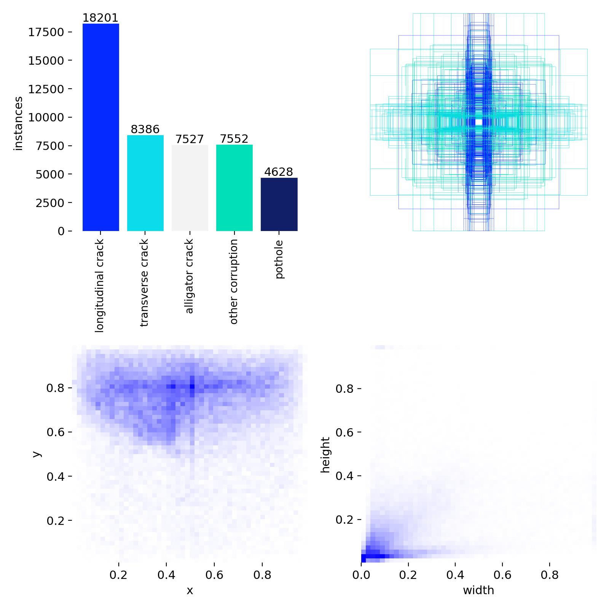
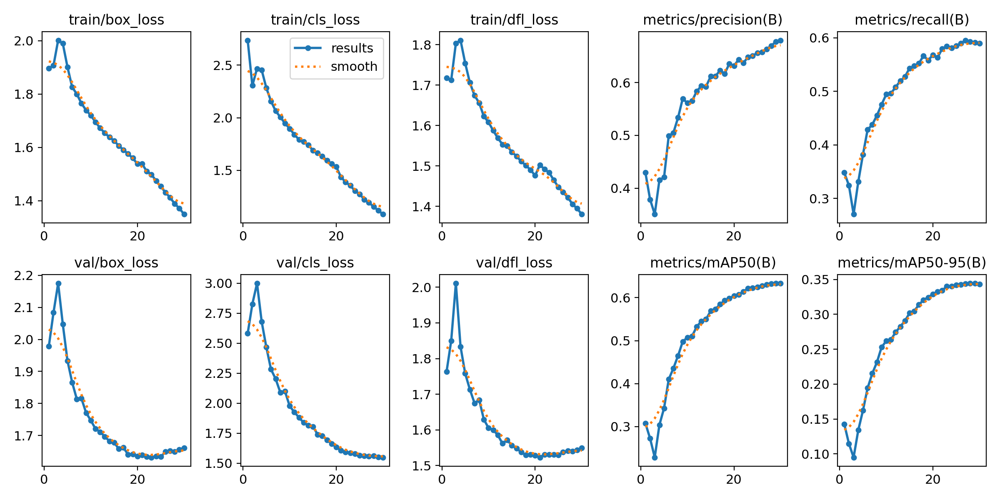
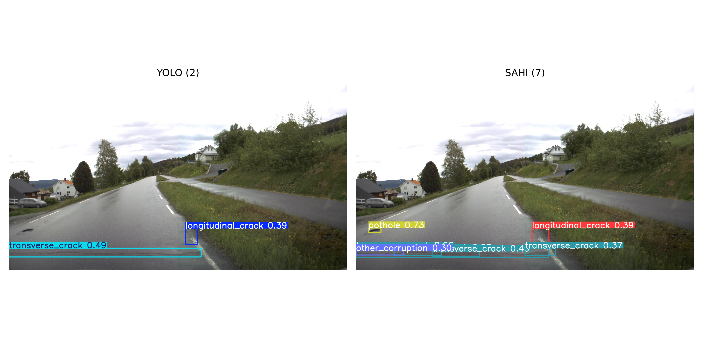
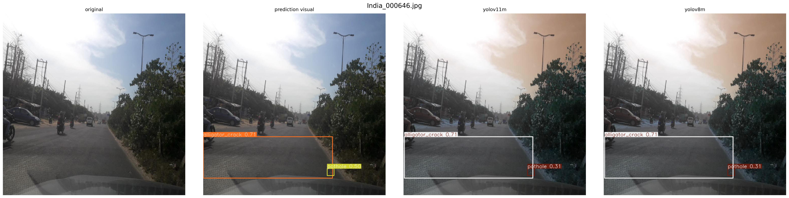
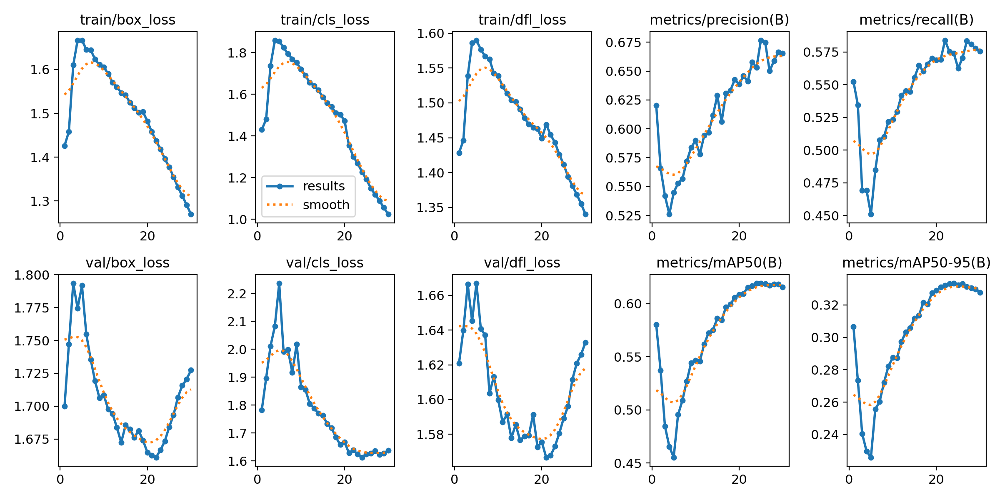
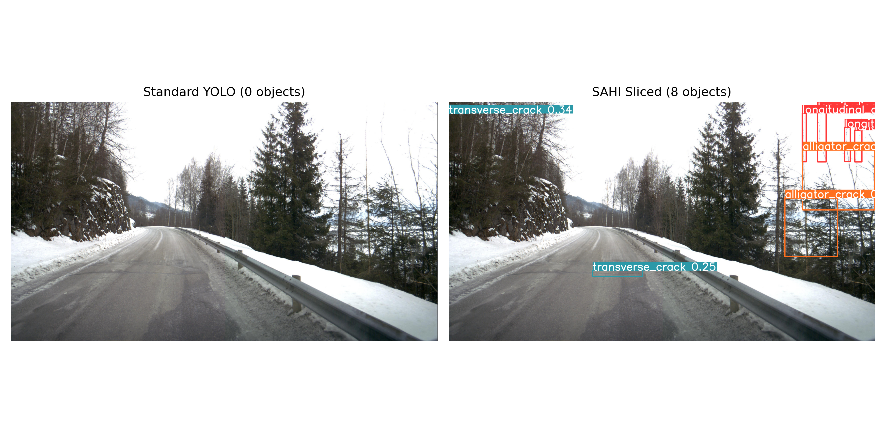
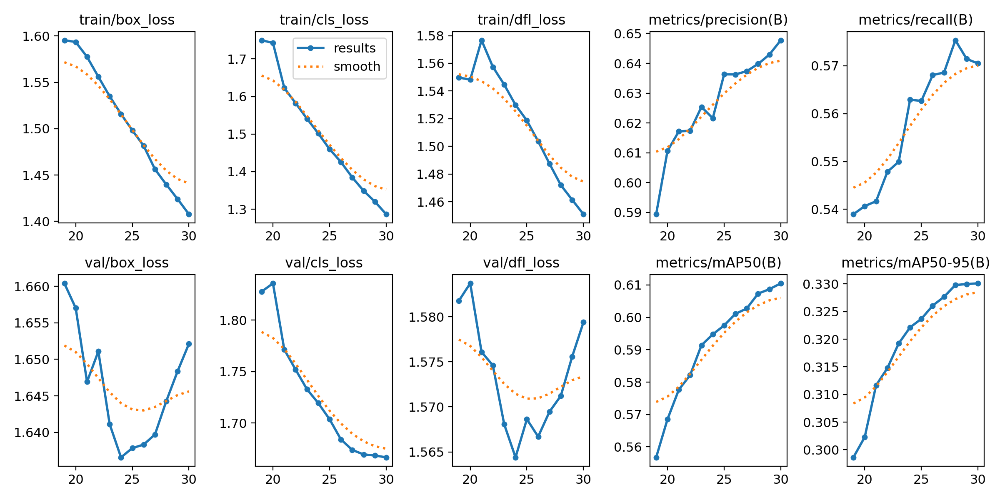
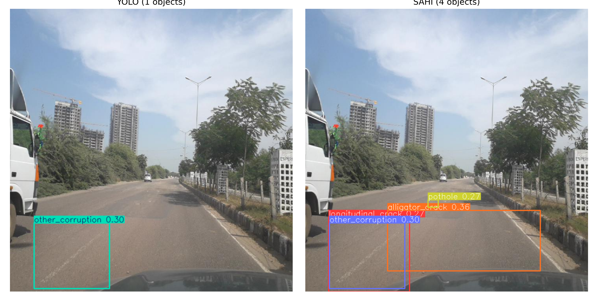

# Road Damage Detection Using YOLOv8, YOLO11, Faster R-CNN, SAHI, and a Custom Hybrid Architecture

This repository contains the full experimental record for a Bachelor's thesis on automated road damage detection using deep learning. The work systematically evaluates seven baseline detectors, applies slicing-aided inference (SAHI) across all of them, develops a custom hybrid detection architecture integrating Deformable Attention Transformer (DAT) blocks, an Adaptive Edge-aware Feature Pyramid Network (AEFPN) neck, and a Lightweight Shared Convolutional Detection (LSCD) head, and validates the architecture through component-level ablation studies.

---

## Project Overview

Road surface deterioration -- longitudinal cracks, transverse cracks, alligator cracking, potholes, and other surface corruption -- causes vehicle damage and raises maintenance costs at scale. Manual inspection is slow, inconsistent, and difficult to conduct nationally. This thesis investigates automated detection using deep learning across the full RDD2022 benchmark (India, Japan, Norway, the United States, and the Czech Republic) and a focused India-subset evaluation.

The research follows four stages:

1. **Baseline evaluation** of seven object detection models under identical training conditions.
2. **SAHI inference** applied to all YOLO variants to assess the gain from sliced inference on small and distant road defects.
3. **Hybrid architecture** -- YOLOv8m-full-hybrid -- integrating DAT attention in the backbone and EMA/AAM modules in the neck, trained on the full RDD2022 dataset.
4. **Ablation studies** decomposing the individual contributions of the DAT and AEFPN components.

Crack segmentation experiments (U-Net and DeepLabV3+ on Crack500) were conducted as a separate exploratory study and are documented in this repository for completeness.

---

## Experimental Roadmap

```
Stage 1 -- Baseline Detectors (30 epochs, RDD2022)
  YOLOv8n / YOLOv8s / YOLOv8m
  YOLO11n / YOLO11s / YOLO11m
  Faster R-CNN (ResNet50-FPN)
         |
         v
Stage 2 -- SAHI Inference Evaluation (2,000-image subset)
  Applied to all six YOLO variants
  Ablation: confidence threshold and slice size (YOLO11m)
  Exploratory: Faster R-CNN + SAHI
         |
         v
Stage 3 -- Hybrid Architecture (YOLOv8m-full-hybrid)
  Backbone: C2fDAttn blocks (DAT attention) at backbone stages 3 and 4
  Neck: AAM + EMA modules (AEFPN)
  Head: LSCD (Lightweight Shared Convolutional Detection) with per-scale learnable multipliers
  Trained on full RDD2022 (30 epochs, extended to 60 epochs)
  Also: India-subset training (100 epochs) + SAHI on hybrid model
         |
         v
Stage 4 -- Ablation Studies (30 epochs, RDD2022)
  DAT-only: C2fDAttn backbone + standard FPN neck
  DAT + AEFPN: C2fDAttn backbone + AAM/EMA neck (full hybrid)
```

---

## Repository Structure

```text
Thesis/
├── datasets/
│   └── RDD_SPLIT/                    # RDD2022 train/val/test in YOLO format
├── detection/
│   └── checkpoints/                  # Trained model weights (.pt, .pth)
├── notebooks/                        # 25 Jupyter notebooks
│   ├── 01_dataset_exploration.ipynb
│   ├── 02_yolov8n_baseline.ipynb
│   ├── 03_yolov8s_baseline.ipynb
│   ├── 04-sahi-yolov8n.ipynb
│   ├── 05-sahi-yolov8s.ipynb
│   ├── 06-yolov8m-baseline.ipynb
│   ├── 07-sahi-yolov8m.ipynb
│   ├── 08-unet-crack500.ipynb            # Exploratory segmentation
│   ├── 09-deeplabv3plus-crack500.ipynb
│   ├── 10_segmentation_comparison.ipynb
│   ├── 11-13 -- YOLO11 baseline series
│   ├── 14-faster-rcnn.ipynb
│   ├── 15-18 -- YOLO11 SAHI + Faster R-CNN SAHI series
│   ├── 19-yolov8m-vs-yolov11m.ipynb
│   ├── 20-yolov8m-full-hybrid.ipynb      # Full hybrid training
│   ├── 21-yolov8m-dat-ablation.ipynb     # DAT-only ablation
│   ├── 22-yolov8-dat-aefpn-ablation.ipynb
│   ├── 23-yolo-hybrid-india.ipynb        # Hybrid model, India subset
│   ├── 24-yolo-hybrid-india-sahi.ipynb
│   └── 25-india-baseline-yolo.ipynb
├── reports/
│   ├── methodology/                      # Architecture docs, base model notes, module ranking
│   ├── results/
│   │   ├── detection/                    # Per-model metrics, confusion matrices, PR curves
│   │   │   ├── yolov8n / yolov8s / yolov8m
│   │   │   ├── yolov11n / yolov11s / yolov11m
│   │   │   ├── faster_rcnn
│   │   │   ├── full_hybrid_run           # Hybrid 30-epoch run
│   │   │   ├── full_hybrid_50e           # Extended 50-epoch hybrid run
│   │   │   ├── ablation_dat_only
│   │   │   ├── ablation_dat_aefpn
│   │   │   ├── full_hybrid_india_subset
│   │   │   ├── full_hybrid_india_100e
│   │   │   ├── baseline_yolov8m_india_subset
│   │   │   └── sahi/                     # SAHI evaluation outputs and comparisons
│   │   ├── eda/                          # Dataset exploration figures
│   │   ├── final_figures/                # Thesis-ready figure exports
│   │   └── segmentation/                 # U-Net and DeepLabV3+ results
│   └── final_report/
├── ultralytics/                          # Custom Ultralytics fork with DAT and AEFPN modules
├── requirements.txt
└── README.md
```

---

## Dataset

### RDD2022 (Detection)

The Road Damage Detection 2022 dataset provides road-view images collected across five countries using vehicle-mounted cameras. Images are annotated with bounding boxes across five damage categories:

| Class ID | Label | Description |
|----------|-------|-------------|
| 0 | Longitudinal Crack | Cracks running parallel to the direction of travel |
| 1 | Transverse Crack | Cracks running perpendicular to the direction of travel |
| 2 | Alligator Crack | Interconnected crack networks typical of fatigue damage |
| 3 | Other Corruption | Surface defects not belonging to the other categories |
| 4 | Pothole | Depression or hole in the road surface |

**Split used for all experiments:**

| Split | Images |
|-------|--------|
| Train | 26,870 |
| Validation | 5,759 |
| Test | 5,759 |

All models were trained at 640x640 resolution, batch size 16. The same train/val/test split was used across all stages.

<p align="center">
  
</p>

<p align="center">
  <em>Class and bounding box distribution across the RDD2022 training split. Longitudinal and transverse cracks dominate; potholes are the rarest category.</em>
</p>

---

## Stage 1 -- Baseline Detection

Seven models were trained from pretrained ImageNet weights for 30 epochs on the full RDD2022 dataset with identical augmentation and hyperparameter settings.

### Results

| Model | Precision | Recall | mAP@50 | mAP@50-95 |
|-------|-----------|--------|--------|-----------|
| YOLOv8n | 0.579 | 0.516 | 0.539 | 0.285 |
| YOLOv8s | 0.626 | 0.553 | 0.592 | 0.317 |
| **YOLOv8m** | **0.677** | **0.590** | **0.633** | **0.344** |
| YOLO11n | 0.593 | 0.514 | 0.544 | 0.287 |
| YOLO11s | 0.613 | 0.540 | 0.575 | 0.309 |
| YOLO11m | 0.631 | 0.546 | 0.587 | 0.314 |
| Faster R-CNN | -- | 0.427 | 0.536 | 0.253 |

**Key findings:**

- **YOLOv8m** achieved the highest scores across all four metrics and was selected as the backbone of the hybrid architecture.
- Within both the YOLOv8 and YOLO11 families, each step up in model size yielded consistent gains in precision and recall.
- YOLO11 variants scored slightly below their YOLOv8 counterparts on this dataset. Qualitative inspection suggested fewer false positives on challenging images (snow-covered roads, vegetation, worn lane markings), though this did not translate to a clear metric advantage.
- Faster R-CNN reached competitive mAP@50 (0.536) but produced the lowest recall (0.427) and was substantially slower at inference than YOLO variants.

<p align="center">
  
</p>

<p align="center">
  <em>Training curves for YOLOv8m baseline (30 epochs, full RDD2022 dataset). mAP@50 reaches 0.633 at epoch 30, with consistent gains in precision and recall throughout training.</em>
</p>

---

## Stage 2 -- SAHI Inference

SAHI (Slicing Aided Hyper Inference) divides each image into overlapping tiles, runs detection on each tile independently, and merges predictions using NMS. This improves sensitivity to small and distant road defects that are frequently missed during standard full-image inference.

All SAHI evaluations used 512x512 tiles, 0.2 overlap ratio, and a confidence threshold of 0.25, evaluated on a 2,000-image subset of the RDD2022 test split.

### Detection Count Gain

| Model | Baseline Detections | SAHI Detections | Gain |
|-------|--------------------:|----------------:|-----:|
| YOLOv8n | 3,773 | 4,564 | +20.96% |
| YOLOv8s | 4,237 | 5,475 | +29.22% |
| YOLOv8m | 4,551 | 5,321 | +16.92% |
| YOLO11n | 3,612 | 4,496 | +24.47% |
| YOLO11s | 4,016 | 4,826 | +20.17% |
| YOLO11m | 3,986 | 4,722 | +18.46% |

### SAHI COCO Evaluation Metrics

| Model | Precision | Recall | mAP@50 | mAP@50-95 |
|-------|-----------|--------|--------|-----------|
| YOLOv8n | 0.380 | 0.285 | 0.380 | 0.186 |
| YOLOv8s | 0.441 | 0.311 | 0.441 | 0.218 |
| **YOLOv8m** | **0.484** | **0.347** | **0.484** | **0.247** |
| YOLO11n | 0.380 | 0.277 | 0.380 | 0.184 |
| YOLO11s | 0.421 | 0.301 | 0.421 | 0.207 |
| YOLO11m | 0.412 | 0.301 | 0.412 | 0.203 |

**Key findings:**

- SAHI increased detection counts for every model. The additional detections predominantly cover small-area damage missed by baseline inference.
- The COCO metrics reflect the standard SAHI trade-off: improved recall of small defects at the cost of increased false positives, reducing precision and mAP relative to baseline.
- YOLOv8m retained the strongest COCO metrics under SAHI, confirming its position as the best detector overall.

<p align="center">
  
</p>

<p align="center">
  <em>Standard YOLOv8m inference (left) vs. SAHI-enhanced inference (right). Sliced inference recovers multiple small surface defects that the full-image pass misses entirely.</em>
</p>

<p align="center">
  
</p>

<p align="center">
  <em>Side-by-side comparison on an India road image. SAHI substantially increases detected alligator cracks and longitudinal defects across a heavily damaged road surface.</em>
</p>

### SAHI Hyperparameter Ablation (YOLO11m)

| Slice Size | Confidence | Precision | Recall | mAP@50 | mAP@50-95 |
|------------|------------|-----------|--------|--------|-----------|
| 512 x 512 | 0.25 | 0.412 | 0.301 | 0.412 | 0.203 |
| 512 x 512 | 0.50 | 0.307 | 0.218 | 0.307 | 0.171 |
| 640 x 640 | 0.25 | 0.402 | 0.299 | 0.402 | 0.208 |

- Raising the confidence threshold from 0.25 to 0.50 significantly reduced recall and mAP: many correct small-defect detections were filtered out.
- Increasing slice size from 512 to 640 did not improve performance on RDD2022.
- The default configuration (512x512, confidence 0.25) was applied to all remaining SAHI evaluations.

### Faster R-CNN + SAHI (Exploratory)

| Model | Images | Baseline Detections | SAHI Detections | Gain |
|-------|--------|--------------------:|----------------:|-----:|
| Faster R-CNN | 2,000 | 6,899 | 11,256 | +63.15% |

| Model | Precision | Recall | mAP@50 | mAP@50-95 |
|-------|-----------|--------|--------|-----------|
| Faster R-CNN + SAHI | 0.203 | 0.271 | 0.203 | 0.086 |

Detection count increased by 63%, but qualitative analysis confirmed that most additional predictions were duplicate bounding boxes and false positives. Faster R-CNN's region proposal mechanism interacts poorly with tile boundaries under SAHI. This experiment is presented as an exploratory study only.

---

## Stage 3 -- Hybrid Architecture

Based on Stage 1 and 2 evaluation, YOLOv8m was selected as the backbone for architectural modification. The custom hybrid model integrates three components.

### Architecture: YOLOv8m-full-hybrid

**149 layers, 23.3M parameters, 67.0 GFLOPs**

**Backbone modification -- C2fDAttn (DAT Attention):**
Standard C2f blocks at backbone stages 3 and 4 are replaced with C2fDAttn blocks, which use Deformable Attention Transformer layers within each bottleneck. DAT layers learn spatially adaptive sampling offsets, allowing each feature location to attend to the most relevant positions across the feature map. This is well suited to road damage detection, where crack patterns are irregular, elongated, and appear at varied scales and orientations.

**Neck modification -- AEFPN:**
Two types of attention modules augment the standard FPN:

- **AAM (Adaptive Attention Module)**: Applied at the SPPF output. Recalibrates feature channels using global context before pyramid construction.
- **EMA (Efficient Multi-scale Attention)**: Applied at each FPN fusion output. Provides lightweight multi-scale channel attention before the detection head.

**Head modification -- LSCD (Lightweight Shared Convolutional Detection):**
The standard YOLOv8 detection head uses independent convolutional branches for each of the three prediction scales (P3, P4, P5), resulting in a large and redundant parameter count. The LSCD head replaces these with a single shared convolutional block whose weights are reused across all three scales. Each scale then applies its own learnable scale multiplier and per-scale bias offset, allowing the shared features to be independently calibrated per prediction level. This design reduces the total detection head parameter count while preserving per-scale flexibility. The shared weights are implemented via `SharedConvBlock` in `lscd.py`, with `LSCDRegressionHead` handling bounding box regression and `LSCDClassificationHead` handling class probability prediction across all three output scales.

The full layer-by-layer architecture is logged in notebook `20-yolov8m-full-hybrid.ipynb`.

### Full Hybrid Results -- RDD2022 (30 Epochs)

All ablation and hybrid variants were trained from random initialisation (pretrained weights are incompatible with the modified architecture).

| Model | Precision | Recall | mAP@50 | mAP@50-95 |
|-------|-----------|--------|--------|-----------|
| YOLOv8m baseline (pretrained) | 0.677 | 0.590 | 0.633 | 0.344 |
| YOLOv8m-full-hybrid (30e, scratch) | 0.634 | 0.581 | 0.607 | 0.328 |

The hybrid model trained from scratch requires more epochs to match a pretrained baseline. At 30 epochs it reaches mAP@50 0.607 and continues improving.

### Extended Training -- 60 Epochs (best.pt validation)

| Epoch | mAP@50 | mAP@50-95 |
|-------|--------|-----------|
| 10 | 0.547 | 0.287 |
| 20 | 0.609 | 0.329 |
| 30 | 0.615 | 0.328 |
| Best (Ep. 24) | 0.619 | 0.333 |

<p align="center">
  
</p>

<p align="center">
  <em>Training curves for the full hybrid model (50-epoch run). Box loss, classification loss, and DFL loss converge steadily; mAP@50 reaches 0.619 at epoch 50.</em>
</p>

### SAHI on the Hybrid Model

| Metric | Value |
|--------|-------|
| Baseline detections (hybrid) | 9,115 |
| SAHI detections (hybrid) | 12,967 |
| Detection gain | +42.26% |
| mAP@50 | 0.471 |
| mAP@50-95 | 0.238 |
| Recall (AR@100) | 0.342 |

The hybrid model produced a substantially larger SAHI detection gain (+42.26%) compared to the standard YOLOv8m baseline (+16.92%). The DAT attention backbone makes the model more responsive to fine-grained spatial features, which are precisely the features SAHI surfaces through sliced inference.

<p align="center">
  
</p>

<p align="center">
  <em>Standard hybrid model inference (left) vs. SAHI-enhanced hybrid inference (right). The combination of DAT attention and sliced inference recovers dense and fragmented crack patterns that neither approach surfaces alone.</em>
</p>

---

## Stage 4 -- Ablation Studies

Two ablation configurations isolate the individual contributions of the backbone and neck modifications. In all ablation variants, the LSCD head is present.

| Configuration | Backbone | Neck | Head |
|---------------|----------|------|------|
| DAT-only | C2fDAttn | Standard FPN | LSCD |
| DAT + AEFPN | C2fDAttn | AAM + EMA (AEFPN) | LSCD |
| Full Hybrid | C2fDAttn | AAM + EMA (AEFPN) | LSCD |

### Ablation Results (Epoch 30)

| Configuration | Precision | Recall | mAP@50 | mAP@50-95 |
|---------------|-----------|--------|--------|-----------|
| YOLOv8m baseline (pretrained) | 0.677 | 0.590 | 0.633 | 0.344 |
| DAT-only (scratch) | 0.646 | 0.570 | 0.607 | 0.326 |
| DAT + AEFPN / full hybrid (scratch) | 0.648 | 0.570 | 0.611 | 0.330 |

The full hybrid model consistently outperforms the DAT-only variant, confirming that the AEFPN neck adds a measurable gain beyond the backbone attention alone. The margin is modest at 30 epochs and is expected to widen with longer training.

<p align="center">
  
</p>

<p align="center">
  <em>Training curves for the DAT + AEFPN ablation (30 epochs). mAP@50 reaches 0.611 at epoch 30, continuing to improve beyond the training window.</em>
</p>

---

## India Subset Experiments

The hybrid model and the standard YOLOv8m baseline were also evaluated separately on the India subset of RDD2022, which concentrates on severe alligator cracking and pothole damage typical of Indian road conditions (~3,360 training images).

### India Baseline (YOLOv8m, 30 Epochs)

| Precision | Recall | mAP@50 | mAP@50-95 |
|-----------|--------|--------|-----------|
| 0.389 | 0.339 | 0.336 | 0.157 |

### Hybrid Model -- India Subset (100 Epochs)

| Epoch | mAP@50 | mAP@50-95 |
|-------|--------|-----------|
| 30 | 0.175 | 0.074 |
| 50 | 0.253 | 0.117 |
| 74 | 0.324 | 0.143 |
| 100 | 0.325 | 0.144 |

Performance on the India subset is significantly lower than on the full RDD2022 dataset. The substantially smaller India subset (~3,360 training images vs. 26,870 for full RDD2022) is insufficient for the DAT attention layers to learn effective deformable sampling patterns when trained from scratch. The full-dataset results remain the primary comparison point.

<p align="center">
  
</p>

<p align="center">
  <em>SAHI inference with the hybrid model on an India subset road image. Dense alligator cracking and pothole damage across a deteriorated road surface are recovered through sliced inference.</em>
</p>

---

## Consolidated Results

| Model | Stage | Precision | Recall | mAP@50 | mAP@50-95 |
|-------|-------|-----------|--------|--------|-----------|
| YOLOv8n | Baseline | 0.579 | 0.516 | 0.539 | 0.285 |
| YOLOv8s | Baseline | 0.626 | 0.553 | 0.592 | 0.317 |
| YOLOv8m | Baseline | 0.677 | 0.590 | 0.633 | 0.344 |
| YOLO11n | Baseline | 0.593 | 0.514 | 0.544 | 0.287 |
| YOLO11s | Baseline | 0.613 | 0.540 | 0.575 | 0.309 |
| YOLO11m | Baseline | 0.631 | 0.546 | 0.587 | 0.314 |
| Faster R-CNN | Baseline | -- | 0.427 | 0.536 | 0.253 |
| YOLOv8m + SAHI | SAHI | 0.484 | 0.347 | 0.484 | 0.247 |
| YOLOv8m-dat-only | Ablation | 0.646 | 0.570 | 0.607 | 0.326 |
| YOLOv8m-dat-aefpn | Ablation | 0.648 | 0.570 | 0.611 | 0.330 |
| YOLOv8m-full-hybrid (50e) | Hybrid | 0.665 | 0.576 | 0.619 | 0.333 |
| YOLOv8m-full-hybrid + SAHI | Hybrid + SAHI | 0.471 | 0.342 | 0.471 | 0.238 |

---

## Comparison with Recent Literature

| Method | Year | Dataset | mAP@50 | mAP@50-95 |
|--------|------|---------|--------|-----------|
| RDD-YOLO | 2024 | RDD2022 | 62.5 | 36.4 |
| Improved YOLOv8 | 2024 | RDD2022 | 65.7 | -- |
| YOLOv8-PD | 2024 | RDD2022 | 70.6 | 39.5 |
| YOLO-RD | 2025 | Japan subset | 55.62 | 25.75 |
| OBC-YOLOv8 | 2025 | China subset | 86.0 | -- |
| SEA-YOLOv8 | 2025 | RDD2022 | 63.2 | -- |
| **YOLOv8m (this work)** | **2026** | **RDD2022** | **63.3** | **34.4** |
| **YOLOv8m-full-hybrid (this work)** | **2026** | **RDD2022** | **61.9** | **33.3** |

YOLOv8m achieves competitive performance relative to several recent task-specific methods. Direct comparison is limited because different papers use different country subsets, class definitions, and evaluation protocols. The hybrid model, trained entirely from scratch (no pretrained weights), reaches comparable performance to the pretrained baseline and continues to improve with training length.

---

## Key Findings

**Baseline comparison:**
- Larger model variants consistently outperform smaller ones within each family.
- YOLOv8m outperforms YOLO11m at the same scale, likely due to pretraining weight availability and dataset fit.
- Faster R-CNN is competitive in mAP@50 but underperforms in recall and is substantially slower.

**SAHI evaluation:**
- SAHI increases detection counts for every YOLO model, recovering small and distant road defects.
- The trade-off is reduced precision and mAP under COCO evaluation due to additional false positives.
- Default settings (512x512 tiles, confidence 0.25) give the best sensitivity-specificity balance.
- Faster R-CNN is poorly suited to SAHI due to region proposal tile boundary effects.

**Hybrid architecture:**
- The combination of DAT attention backbone, AEFPN neck, and LSCD head achieves mAP@50 competitive with the pretrained baseline given sufficient training, while using 10% fewer parameters (23.3M vs 25.8M) and 15% fewer GFLOPs (67.0 vs 78.7).
- The LSCD head reduces the detection head parameter count by sharing convolutional weights across all three prediction scales, with per-scale learnable multipliers preserving independent calibration at P3, P4, and P5.
- The +42.26% SAHI detection gain for the hybrid model (vs. +16.92% for standard YOLOv8m) is the most distinctive result: DAT attention makes the model substantially more responsive to the fine-grained spatial features that SAHI surfaces through slicing.
- The ablation studies confirm that the AEFPN neck provides a consistent, measurable gain over the DAT backbone alone.

**Common failure cases:**
- Vegetation, roadside plants, and tree shadows triggering false positives
- Snow-covered road regions misclassified as surface damage
- High-contrast asphalt textures and worn or painted lane markings
- Complex or patched road surfaces with irregular texture patterns

---

## Exploratory: Crack Segmentation

As a separate exploratory study, U-Net and DeepLabV3+ were trained on the Crack500 pixel-level segmentation dataset (ResNet34 encoder, 30 epochs). This work is independent of the main detection pipeline.

| Model | Encoder | Dice | IoU |
|-------|---------|------|-----|
| U-Net | ResNet34 | 0.7533 | 0.6118 |
| DeepLabV3+ | ResNet34 | 0.7389 | 0.5931 |

| Comparative Method | Year | Dice (%) | IoU (%) |
|--------------------|------|----------|---------|
| Pyramid Attention Network | 2020 | 76.81 | 62.35 |
| Dual Flow Fusion Model | 2023 | 78.10 | 66.00 |
| Distribution-aware NLL | 2024 | 74.74 | 60.56 |
| EGA-UNet | 2025 | 77.80 | 70.00 |
| U-Net (this work) | 2026 | 75.33 | 61.18 |

Full results, loss curves, and prediction examples are in `reports/results/segmentation/`. Potential directions include combining pixel-level segmentation with the detection pipeline for per-instance severity grading.

---

## Experimental Artifacts

The `reports/results/` directory contains the complete experimental output:

- Training loss and metric curves for all detection and segmentation models
- Confusion matrices (raw and normalised) for every YOLO variant
- Precision-Recall and F1-score curves
- SAHI side-by-side comparison images and top-gain examples for each model
- Hybrid model and ablation training curves and validation prediction grids
- India subset experiment results and SAHI comparison images
- Segmentation prediction examples (U-Net, DeepLabV3+)
- Thesis-ready figures in `reports/results/final_figures/`

---

## Potential Future Directions

- Transformer-based detection architectures (RT-DETR, DINO, Grounding DINO)
- Longer hybrid training schedules to allow DAT layers to fully converge
- Domain adaptation across RDD2022 country subsets without per-country fine-tuning
- Pixel-level segmentation integrated with the detection pipeline for damage severity grading
- Edge device deployment benchmarking (TensorRT, ONNX, CoreML)
- Evaluation on additional country-specific road damage datasets

---

## Author

**Aadeesh Ranjan**

B.Tech Computer Science and Engineering, BML Munjal University